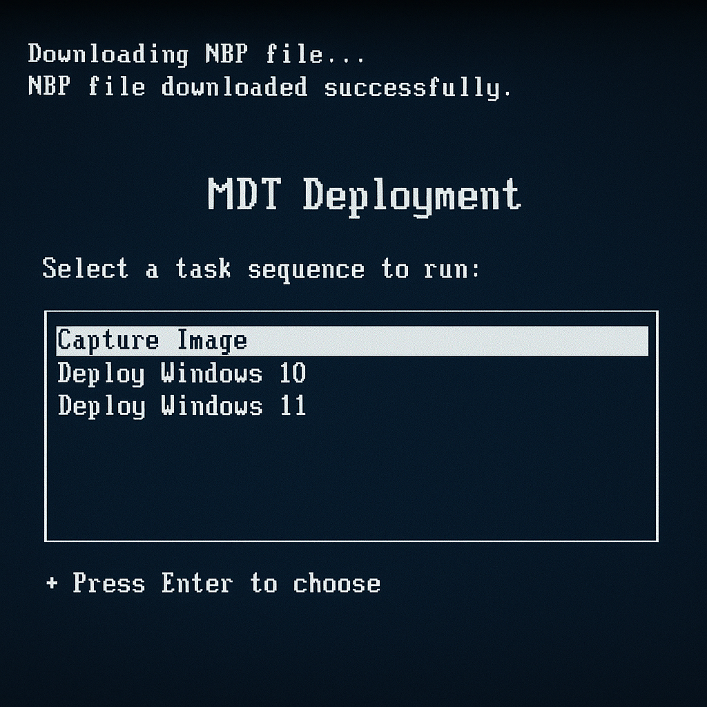
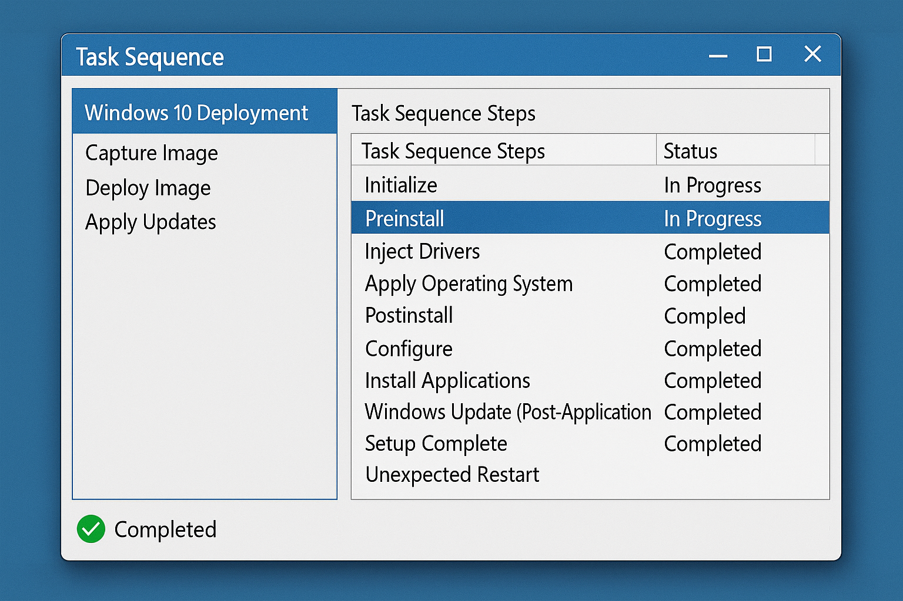
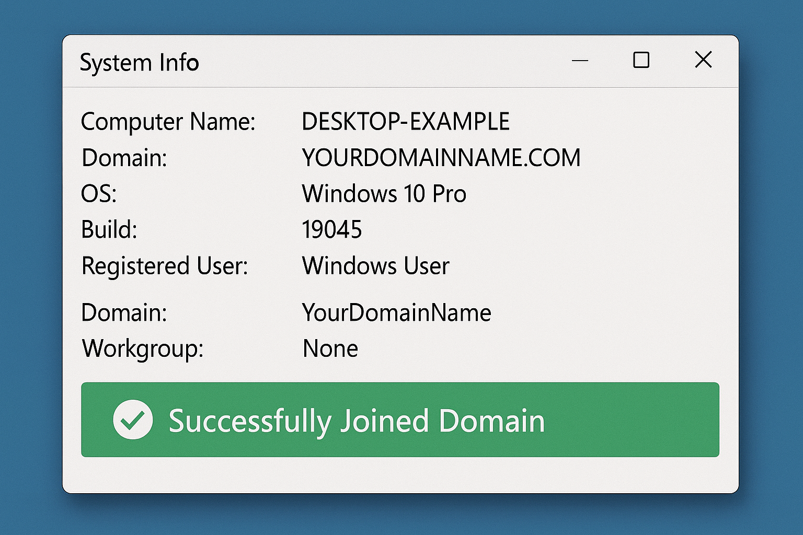
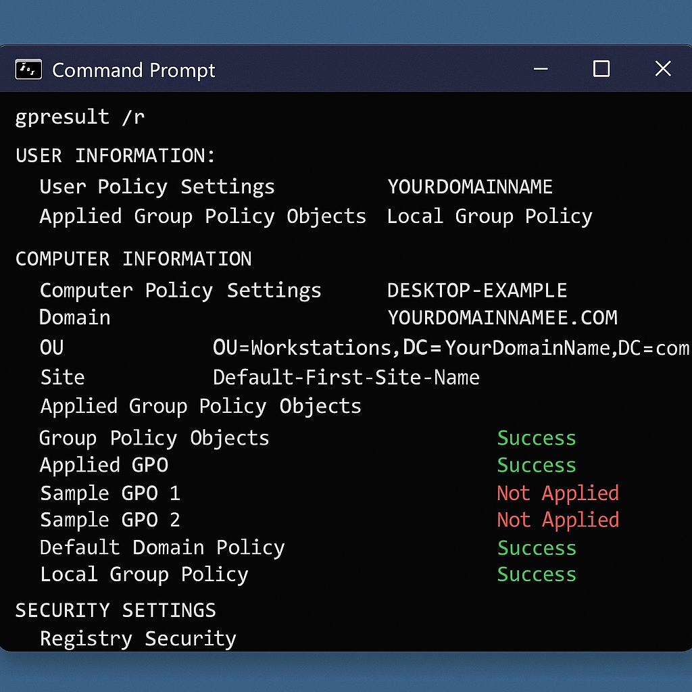
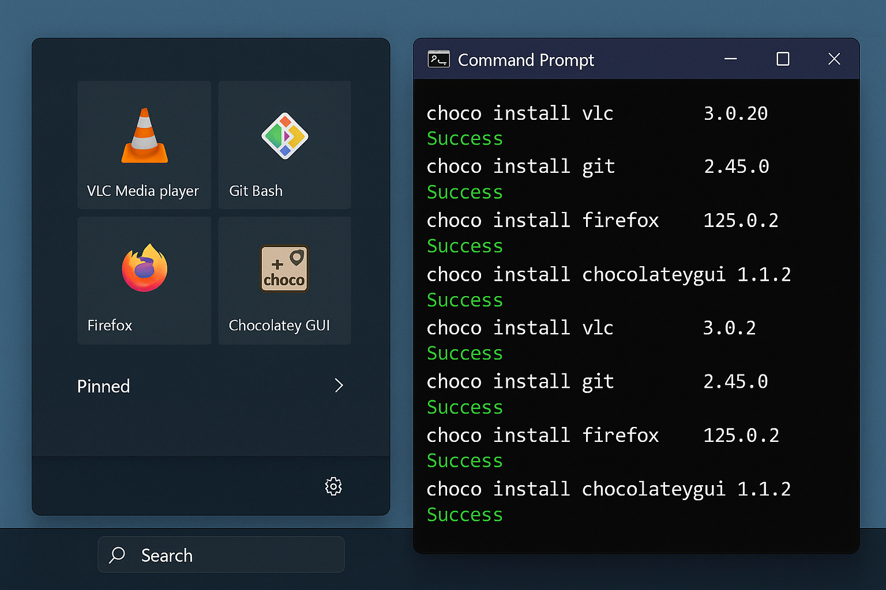
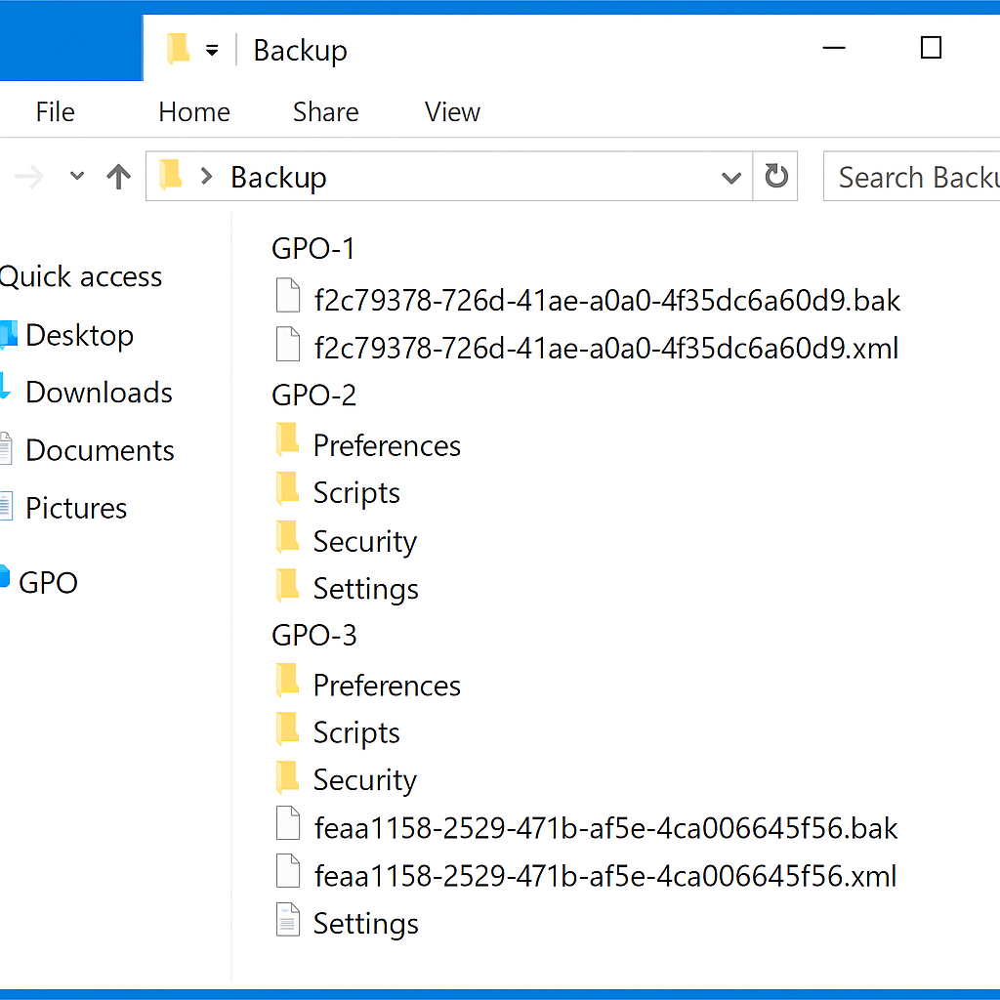

# 🖥️ Enterprise Windows Deployment Project

## 📌 Overview

This project simulates a real-world enterprise environment where Windows client machines are deployed and configured automatically using:

- PXE Boot via WDS + MDT
- Domain Join via PowerShell
- GPOs for software/config enforcement
- OU structure and automation via scripting

---

## 💻 Tools Used

- Windows Server 2019/2022
- Microsoft Deployment Toolkit (MDT)
- Windows Deployment Services (WDS)
- Group Policy Management
- PowerShell scripting
- Active Directory Domain Services (AD DS)
- Chocolatey

---

## 📁 Directory Structure

```
Enterprise-Deployment/
├── Scripts/
│   ├── Create-OUs.ps1
│   ├── Join-Domain.ps1
│   ├── Deploy-Apps.ps1
│   ├── Backup-GPOs.ps1
│   ├── Restore-GPOs.ps1
│   └── Import-MDT-TaskSequence.ps1
├── Screenshots/
└── README.md
```

---

## 🧪 Lab Workflow

1. ✅ Install & configure Active Directory, DHCP, DNS
2. ✅ Set up WDS and MDT
3. ✅ Import Windows ISO and create a Task Sequence
4. ✅ Configure PXE boot for automated installs
5. ✅ Run PowerShell scripts:
   - Create OUs
   - Auto-join domain
   - Deploy essential apps
   - Backup and restore GPOs
   - Import MDT sequences automatically
6. ✅ Link GPOs to automate security policies, drive mappings, etc.

---

## 🚰 Infrastructure Diagram

```
[ PXE Boot Client ]
        |
     (PXE)
        ↓
[ WDS/MDT Server on Windows Server ]
        |
        ↓
[ Windows Server AD DS + DHCP + DNS ]
        |
        ↓
[ Joined Windows 10 PC with Auto GPOs Applied ]
```

---

## 🛠️ PowerShell Automation

### `Scripts/Create-OUs.ps1`

```powershell
Import-Module ActiveDirectory

$OUs = @(
    "OU=IT,DC=lab,DC=local",
    "OU=HR,DC=lab,DC=local",
    "OU=Finance,DC=lab,DC=local",
    "OU=Sales,DC=lab,DC=local",
    "OU=Workstations,DC=lab,DC=local"
)

foreach ($ou in $OUs) {
    if (-not (Get-ADOrganizationalUnit -LDAPFilter "(distinguishedName=$ou)" -ErrorAction SilentlyContinue)) {
        New-ADOrganizationalUnit -Name ($ou -split '=')[1] -Path ((($ou -split ',') | Select-Object -Skip 1) -join ',')
        Write-Host "Created $ou"
    }
}
```

### `Scripts/Join-Domain.ps1`

```powershell
Add-Computer -DomainName "lab.local" -OUPath "OU=Workstations,DC=lab,DC=local" -Credential (Get-Credential) -Restart
```

### `Scripts/Deploy-Apps.ps1`

```powershell
Set-ExecutionPolicy Bypass -Scope Process -Force
[System.Net.ServicePointManager]::SecurityProtocol = [System.Net.SecurityProtocolType]::Tls12

if (-not (Get-Command choco -ErrorAction SilentlyContinue)) {
    Invoke-Expression ((New-Object System.Net.WebClient).DownloadString('https://chocolatey.org/install.ps1'))
}

choco install -y googlechrome vlc notepadplusplus 7zip git
```

### `Scripts/Backup-GPOs.ps1`

```powershell
$BackupPath = "C:\GPO_Backups"
if (!(Test-Path $BackupPath)) { New-Item -ItemType Directory -Path $BackupPath }
Backup-GPO -All -Path $BackupPath -Comment "Scheduled GPO Backup"
```

### `Scripts/Restore-GPOs.ps1`

```powershell
$BackupPath = "C:\GPO_Backups"
$GPOs = Get-GPO -All

foreach ($gpo in $GPOs) {
    Restore-GPO -Name $gpo.DisplayName -Path $BackupPath -TargetName $gpo.DisplayName -Replace
}
```

### `Scripts/Import-MDT-TaskSequence.ps1`

```powershell
Import-Module "C:\Program Files\Microsoft Deployment Toolkit\bin\MicrosoftDeploymentToolkit.psd1"

$DeploymentShare = "D:\DeploymentShare"
New-Item -Path "$DeploymentShare\Operating Systems\Win10" -ItemType Directory -Force
Import-MDTOperatingSystem -Path $DeploymentShare -SourcePath "D:\Sources\Windows10ISO" -DestinationFolder "Win10"

New-MDTPackage -Name "Install Apps" -Path "$DeploymentShare\Applications" -CommandLine "Deploy-Apps.ps1"
New-MDTTaskSequence -Name "Windows 10 Enterprise Deployment" -Template "Standard Client Task Sequence" -OperatingSystemPath "\Operating Systems\Win10" -Path $DeploymentShare
```

---

## 🖼️ Screenshots

- PXE boot screen with MDT options  
    
- Task Sequence inside MDT  
    
- Domain Join success screen (Windows System Info)  
    
- Group Policy results (gpresult /r)  
    
- Installed apps via Chocolatey (Start Menu or choco list)  
    
- GPO backup folder structure in Explorer  
    
---

## 🔒 Security Notes

- GPO disables guest access and enforces Windows Update
- BitLocker encryption can be enabled via GPO
- Admin shares are disabled and password policies enforced via GPO

---

## 🧠 What I Learned

- Setting up PXE boot environments
- Automating domain joins and provisioning
- Backing up and restoring Group Policies
- Managing task sequences and OS deployments via MDT
- Using PowerShell for mass deployment tasks
- Real-world use of GPOs in enterprise environments

---

## 🔗 Keywords

`System Administration`, `Windows Server`, `Active Directory`, `MDT`, `WDS`, `PXE`, `PowerShell`, `GPO`, `Enterprise Deployment`, `Automation`, `Backup`, `Restore`

---

..........................................................................................mchyasn......................................................
